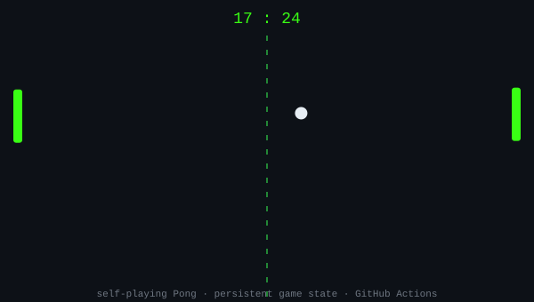

<!-- ANIMATED BANNER -->

<!-- TERMINAL-STYLE TYPING INTRO -->

---

### 🚀 Featured Projects

| Project | What it does | Stack |
|---|---|---|
| [🩸 MalariaVision AI](https://github.com/shivenbansal91/MalariaVision-AI) | Detects malaria from blood smear images — **95.8% accuracy** | TensorFlow · EfficientNetB0 · Flask · React |
| [⚡ GridGuard AI](https://github.com/shivenbansal91/GridGuard-AI) | Real-time electricity theft detection dashboard | Isolation Forest · FastAPI · React · Gemini AI |
| [💰 Smart Finance Manager](https://github.com/shivenbansal91/Smart-Finance-Manager) | Full-stack personal finance tracker with AI insights | Oracle XE 21c · Node.js · React · TypeScript |

---

## 🏓 Live: Self-Playing Pong

Just for fun — this match has been running since I set it up, and it never stops. A GitHub Action plays a few seconds of Pong every couple of hours and pushes the result here. It's genuinely still going right now.

  

---

### 🛠️ Tech I work with

<!--
🎧 LIVE CODING ACTIVITY (WakaTime) — add this back in once WakaTime is set up:

### 📊 What I'm Coding This Week

<!--START_SECTION:waka-->
<!--END_SECTION:waka-->
-->

---

### 📈 GitHub Stats

 

---

### 📫 Reach Me

<!-- swap these for your real links -->

---

<i>Always building. Currently exploring deep learning for healthcare.</i>

